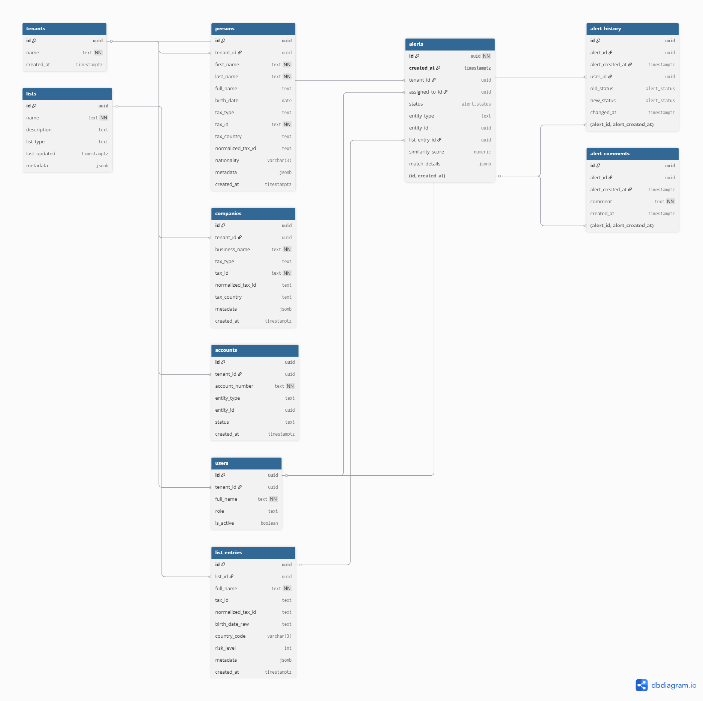

# Complif Challenge - Screening Engine Core 🚀

Este repositorio contiene la arquitectura de base de datos para un motor de screening de cumplimiento (AML/KYC), diseñado para alta performance, multi-tenancy y escalabilidad técnica.

## 🛠️ Cómo levantar el proyecto

El entorno se autoconfigura al iniciar mediante Docker. Solo necesitás ejecutar:

1. **Levantar contenedores:**
   ```bash
   docker-compose up -d```
   
2. **Verificar inicialización:**
   PostgreSQL ejecutará automáticamente los scripts de la carpeta `/migrations` en orden numérico. Podés seguir el proceso en tiempo real con:
   ```bash
   docker logs -f complif_db```
   
3. **Acceso a la DB:**
   - **Host:** `localhost` | **Puerto:** `5432`
   - **Usuario:** `admin` | **Password:** `secret_password`
   - **Base de Datos:** `complif_challenge`
   
### 🚀 Instalación Rápida
1. Clonar el repositorio.
2. Ejecutar `docker-compose up -d`.
3. El sistema aplicará automáticamente las migraciones en `/migrations` (Schema, Functions, RLS, Views).
4. Para realizar una prueba de humo, ejecute:
   `docker exec -i screening_db psql -U admin -d screening_system < scripts/smoke_test.sql`

---

## 📂 Estructura de Migraciones (Pipeline de Inicialización)
Los scripts se encuentran en `/migrations` y son procesados secuencialmente por el entrypoint de Docker:
- **`01_init.sql`**: Habilita extensiones (`pg_trgm`, `uuid-ossp`) y define el esquema `screening` junto con los tipos ENUM globales.
- **`02_schema.sql`**: Construye el core de la base de datos, incluyendo tablas base, lógica de particionamiento y Foreign Keys compuestas.
- **`03_indexes.sql`**: Capa de optimización técnica mediante índices GIN (trigramas) y B-Tree.

---

# 🗄️ Modelo de Datos - Sistema de Screening v2.0

El diseño de la base de datos está optimizado para un entorno **SaaS Multi-tenant**, garantizando el aislamiento de datos, la escalabilidad mediante particionamiento y la trazabilidad total de auditoría.

---

## 1. Entidades Principales (Core)

El sistema utiliza un modelo **Polimórfico** para gestionar las entidades a screenear, permitiendo que tanto personas físicas como jurídicas compartan la lógica de alertas.

- **`tenants`**: Tabla raíz para el aislamiento Multi-tenant. Cada cliente (banco, fintech, etc.) posee su propio `tenant_id`.
- **`persons`**: Almacena personas físicas. 
  - *Dato:* La columna `full_name` es una **Generated Column** persistida para asegurar consistencia en las búsquedas.
- **`companies`**: Almacena personas jurídicas (Empresas).
- **`accounts`**: Vincula las entidades con sus cuentas bancarias. Permite medir la **cobertura de screening** sobre el total de la cartera activa.

## 2. Motor de Listas y Contenido

Diseñado para ser extensible sin cambios en el esquema:

- **`lists`**: Catálogo de fuentes (OFAC, ONU, PEPs, Listas Internas).
- **`list_entries`**: Entradas individuales de cada lista. Incluye columnas de **Normalización de Identificadores Tax** para mejorar la tasa de matching exacto.

## 3. Inteligencia de Alertas y Auditoría

Para el manejo de grandes volúmenes de datos y cumplimiento normativo (Compliance):

- **`alerts` (Tabla Particionada)**: 
  - Se utiliza **Particionamiento por Rango (`RANGE`)** basado en la columna `created_at`. Esto mejora el rendimiento de las consultas sobre alertas recientes y facilita el archivado de datos históricos.
  - Soporta estados dinámicos: `PENDING`, `REVIEWING`, `CONFIRMED`, `DISMISSED`.
- **`alert_status_log`**: Registro inmutable de cambios de estado. Es la base para calcular el **Aging de Alertas** y la **Productividad por Analista**.
- **`alert_comments`**: Trazabilidad de las decisiones tomadas por los analistas durante la investigación.
- **`users`**: Gestión de analistas y supervisores con control de acceso basado en roles (RBAC).

---

## 🛠️ Relaciones y Restricciones Técnicas

### Integridad Referencial Compuesta
Debido al uso de particionamiento en la tabla `alerts`, las tablas dependientes (`alert_comments`, `alert_history`) utilizan **claves foráneas compuestas** (`alert_id`, `alert_created_at`). Esto garantiza la integridad referencial incluso a través de diferentes particiones físicas del disco.

### Seguridad (RLS)
Todas las tablas del esquema `screening` tienen habilitado **Row Level Security**. 
- Las consultas están filtradas automáticamente por el `tenant_id` del usuario en sesión.
- Se previene la filtración de datos sensible entre distintas organizaciones de manera nativa en el motor.

---

## 📐 Diagrama de Relaciones (E-R)



```mermaid
erDiagram (mermaid)
    TENANTS ||--o{ PERSONS : owns
    TENANTS ||--o{ COMPANIES : owns
    TENANTS ||--o{ ACCOUNTS : owns
    TENANTS ||--o{ ALERTS : monitors
    LISTS ||--o{ LIST_ENTRIES : contains
    ALERTS }o--|| LIST_ENTRIES : matches
    ALERTS }o--|| USERS : assigned_to
    ALERTS ||--o{ ALERT_STATUS_LOG : audits
    ALERTS ||--o{ ALERT_COMMENTS : documents
```


---

## 🧠 Decisiones de Arquitectura y Diseño

### 1. ¿Por qué UUID sobre IDs incrementales?
Se optó por el uso de **UUID (v4)** para todas las Primary Keys por tres razones fundamentales:
- **Seguridad:** Evita ataques de enumeración. Nadie puede deducir el volumen de alertas o clientes simplemente sumando +1 al ID.
- **Descentralización:** Permite generar IDs en el backend o en procesos de carga masiva sin necesidad de consultar a la DB por el próximo número, evitando cuellos de botella.
- **Merge de Datos:** Facilita la sincronización entre ambientes o la migración de datos de diferentes fuentes sin riesgo de colisión de claves.

### 2. Particionamiento de Alertas
La tabla `alerts` está **particionada por rango** sobre la columna `created_at`.
- **Performance:** Las consultas de auditoría sobre alertas recientes solo escanean la partición activa, manteniendo el rendimiento constante.
- **Mantenibilidad:** Permite implementar políticas de retención de datos (Data Retention) eliminando particiones antiguas de forma instantánea sin bloquear la tabla principal.

### 3. Motor de Búsqueda (GIN + Trigramas)
Se implementaron índices de trigramas (**GIN**) para permitir búsquedas "fuzzy" (similitud) sobre nombres de personas y empresas. Esto permite que el sistema tolere errores de tipeo o variaciones ortográficas al cruzar datos contra listas restrictivas.

---

## 📊 Documentación e IA Readiness
- **Diagrama ERD:** Ubicado en `/docs/challenge.png` (Exportado desde dbdiagram.io).
- **AI Context:** Se incluye un archivo `.cursorrules` y una estructura de datos clara para facilitar la interacción de agentes de IA con el motor de screening.
- **Multi-tenancy:** Aislamiento lógico obligatorio mediante la columna `tenant_id` en todas las tablas de negocio.

## 💻 Comandos Útiles
- **Reset total de la base:** `docker-compose down -v && docker-compose up -d`
- **Inspección rápida de tablas:** `\dt screening.*`

---

## ⚙️ Funciones de Negocio

### 🔍 Motor de Búsqueda de Tax ID
Se implementó una función inteligente `screening.search_by_tax_id` que resuelve los tres pilares del desafío:

1. **Normalización:** Mediante la función interna `normalize_tax_id`, el sistema ignora guiones, puntos y espacios. Un CUIT `20-30444555-6` y un ID `20.30444555.6` se consideran la misma entidad.
2. **Búsqueda Cross-Country:** El parámetro de país es opcional. Si se omite, el motor busca coincidencias del documento en todas las listas internacionales (Interpol, OFAC, etc.), detectando riesgos globales.
3. **Detección de Sospechosos:** El motor identifica automáticamente inputs inválidos como:
   - **Patrones repetitivos:** (ej. `11111111`, `00000000`).
   - **Longitudes insuficientes:** Documentos de menos de 5 caracteres.
   - **Match Type:** Clasifica cada resultado como `EXACT`, `NORMALIZED` o `FUZZY` con un score de confianza adjunto.

   **Ejemplo de consulta:**
   ```sql
   SELECT * FROM screening.search_by_tax_id('20-30444555-6');

### 🧠 Motor de Similitud (Fuzzy Matching Avanzado)
La función `screening.calculate_similarity` actúa como el evaluador de riesgos, comparando múltiples dimensiones del perfil de una persona.

**Características principales:**
- **Ponderación Inteligente:** No solo compara nombres. El score final se construye dando un peso del 60% al nombre, 30% al documento y 10% a la fecha de nacimiento.
- **Matching de Fechas Parcial:** Reconoce coincidencias incluso si solo disponemos del año o el mes/año, asignando puntajes proporcionales.
- **Seguridad Industrial:** Implementada con `SECURITY DEFINER` para permitir ejecuciones seguras por parte de usuarios con privilegios limitados, garantizando la integridad del proceso de screening.
- **Auditoría en JSONB:** Cada resultado incluye un objeto de detalles con los puntajes individuales de cada campo, permitiendo a los analistas humanos entender el porqué de una alerta.

**Ejemplo de ejecución:**
Si buscamos una coincidencia para un cliente nuevo contra la base de datos:

```sql
SELECT 
    similarity_score, 
    match_type, 
    details->>'name_match' as nombre_score,
    details->>'tax_match' as doc_score
FROM screening.calculate_similarity(
    'Frannco Salvioli',    -- Nombre con error de tipeo
    'Franco Salvioli',     -- Nombre en base de datos
    '20-30444555-6',       -- Documento con guiones
    '20304445556',         -- Documento limpio en DB
    0.80                   -- Umbral de confianza (80%)
);
```

### 🛡️ Motor de Ejecución Polimórfico (Run Screening)
La función `screening.run_screening` es el orquestador principal. Permite procesar tanto personas físicas como jurídicas (`PERSON` / `COMPANY`) contra las listas de control de manera dinámica.

#### 🚀 Optimizaciones Técnicas Destacadas:

1. **Uso de `CROSS JOIN LATERAL` (Iteración Dinámica):**
   A diferencia de un `JOIN` convencional, el uso de `LATERAL` permite que el motor de base de datos ejecute la función de similitud fila por fila, inyectando los datos de la lista directamente como parámetros. Esto permite:
   - Calcular scores complejos en tiempo real sin necesidad de tablas temporales.
   - Filtrar automáticamente resultados que no superan el umbral de confianza definido.

2. **Estrategia `ON CONFLICT DO UPDATE` (Deduplicación):**
   Para evitar la "fatiga de alertas" (crear múltiples registros para el mismo hallazgo), se implementó una lógica de **Upsert**.
   - Si la combinación de `entity_id` y `list_entry_id` ya existe, el sistema **no crea un duplicado**.
   - En su lugar, actualiza el `similarity_score` y los `match_details` de la alerta existente.
   - Esto garantiza que los analistas siempre trabajen sobre la información más reciente y precisa.

3. **Arquitectura Polimórfica:**
   Mediante el uso de `entity_type`, el motor de alertas es agnóstico al modelo de datos, permitiendo escalar la solución a nuevos tipos de entidades en el futuro sin modificar la estructura del esquema.

**Ejemplo de ejecución (On-Demand):**
```sql
-- Ejecutar screening para una persona específica
SELECT * FROM screening.run_screening('PERSON', '550e8400-e29b-41d4-a716-446655440000');
```

--------------------------------------------------------------

## 🔒 Seguridad y Multi-tenancy (RLS)

Se implementó **Row Level Security (RLS)** para garantizar el aislamiento total de datos entre diferentes clientes (tenants).

- **Mecanismo:** El sistema utiliza una variable de sesión `app.current_tenant`.
- **Aislamiento:** Cada consulta ejecutada por la aplicación está filtrada automáticamente a nivel de motor de base de datos. Un tenant **nunca** podrá ver las alertas o entidades de otro, incluso si olvida incluir el `WHERE tenant_id` en su código.
- **Políticas Aplicadas:** Se crearon políticas de tipo `USING` en las tablas `alerts`, `persons` y `companies`.

---------------------------------------------------------------
### 📊 Vista 1: Dashboard de Gestión Operativa
**Nombre:** `screening.v_analyst_pending_dashboard`

Esta vista es la herramienta principal para los analistas de cumplimiento. Proporciona una interfaz unificada para la gestión de casos pendientes.

- **Priorización Inteligente:** Clasifica automáticamente las alertas en 4 niveles de criticidad según el `similarity_score`.
- **Visibilidad de Asignación:** Identifica rápidamente alertas "huérfanas" (Sin asignar) para que los supervisores puedan distribuirlas.
- **Contexto Completo:** Cruza datos de múltiples tablas para mostrar el nombre del cliente y la lista de sanciones involucrada en una sola línea de resultado.

### 📈 Vista 2: Métricas de Efectividad (KPIs)
**Nombre:** `screening.vw_screening_efficiency_metrics`

Esta vista permite calibrar la precisión del motor de búsqueda y la calidad de las listas de control.

- **Hit Rate:** Indica el porcentaje de alertas que resultaron ser coincidencias reales. Un Hit Rate muy bajo sugiere que el umbral de similitud (`threshold`) podría estar muy laxo.
- **False Positive Rate:** Mide el "ruido" generado. Es vital para optimizar la carga operativa de los analistas.
- **Segmentación por Lista:** Identifica qué fuentes de datos (ej. PEPs vs. OFAC) requieren mayor tiempo de análisis debido a la naturaleza de sus matches.

### ⏳ Vista 3: Aging y SLA de Alertas
**Nombre:** `screening.v_alerts_aging`

Esta vista mide los tiempos de respuesta del equipo de cumplimiento, permitiendo identificar cuellos de botella en la investigación.

- **Total Aging:** Calcula el tiempo exacto de vida de una alerta mediante la función `age()`.
- **SLA Status:** Clasificación automática basada en el tiempo de exposición al riesgo. Una alerta sin gestionar por más de 72 horas es marcada como "FUERA DE SLA".
- **Trazabilidad:** Cruza los datos con el log de estados para determinar el momento preciso de resolución, independientemente de cuándo se consulte la vista.


### 📈 Vista 4: Productividad y Performance de Analistas
**Nombre:** `screening.v_analyst_productivity`

Proporciona visibilidad sobre la eficiencia operativa del equipo de cumplimiento.

- **Alertas Resueltas:** Métrica principal de throughput (caudal de trabajo finalizado).
- **Total Actions:** Cuantifica el esfuerzo realizado en el sistema, incluyendo transiciones de estados intermedios.
- **Gestión de Backlog:** Permite a los supervisores balancear la carga de trabajo basándose en el volumen de alertas pendientes por cada usuario.
- **Last Active:** Control de actividad en tiempo real para asegurar la continuidad operativa.


### 🛡️ Vista 5: Cobertura de Screening (Compliance Gap)
**Nombre:** `screening.v_screening_coverage`

Métrica de control de alto nivel que asegura que ninguna cuenta activa sea omitida por el motor de prevención.

- **Total Accounts:** Universo total de cuentas registradas por el tenant.
- **Screened vs. Unscreened:** Identifica proactivamente brechas en el proceso de debida diligencia (KYC/CDD).
- **Coverage %:** KPI crítico para auditorías externas; un valor inferior al 100% indica clientes operando sin haber sido validados contra listas de riesgo.

-----

## 🚀 Benchmarks de Performance & Escalabilidad
*Nota: Las pruebas fueron realizadas localmente sobre el contenedor de Docker configurado en este repositorio.*

Para validar la robustez del sistema, se realizó una prueba de estrés poblando la tabla `screening.list_entries` con **1,000,000 de registros sintéticos**. Las pruebas se ejecutaron en un entorno local (Docker sobre SSD) y los resultados se analizaron mediante el comando `EXPLAIN ANALYZE`.

### 📊 Resultados de las Pruebas de Estrés

Se identificaron tres escenarios clave que demuestran el comportamiento del optimizador de PostgreSQL ante diferentes tipos de búsqueda:

#### 1. Caso Ideal: Búsqueda Indexada de Alta Selectividad
* **Consulta:** Búsqueda difusa de un nombre específico (ej: 'Pablo Escobar').
* **Estrategia:** `Bitmap Index Scan` sobre `idx_list_entries_name_trgm`.
* **Tiempo de Ejecución:** **0.419 ms**
* **Conclusión:** El uso de índices GIST con trigramas permite latencias sub-milisegundo en búsquedas precisas, incluso sobre un millón de registros.

#### 2. Caso de Fuerza Bruta: Búsqueda en Campo No Indexado
* **Consulta:** Similitud (`%`) sobre la columna `tax_id` sin índice de trigramas.
* **Estrategia:** `Parallel Seq Scan` (Uso de múltiples workers en paralelo).
* **Tiempo de Ejecución:** **1,379.50 ms**
* **Conclusión:** Ante la falta de índices especializados, PostgreSQL escala a procesamiento paralelo. Aunque el tiempo es aceptable (~1.3s), el costo computacional es significativamente mayor.

#### 3. "Worst Case Scenario": Términos de Baja Selectividad
* **Consulta:** Términos extremadamente cortos o comunes (ej: '21').
* **Estrategia:** `Bitmap Index Scan` con Recheck masivo.
* **Tiempo de Ejecución:** **3,103.25 ms**
* **Conclusión:** Los términos cortos generan una alta cantidad de "falsos positivos" en el índice, obligando al motor a validar un millón de filas en el Heap.

---

### 💡 Conclusiones Técnicas & Recomendaciones

1.  **Eficiencia de Ingesta:** El proceso de carga masiva alcanzó una tasa de **1M de registros en 35 segundos**, demostrando una alta eficiencia en la escritura y gestión de transacciones.
2.  **Optimización por Índices:** La diferencia entre una búsqueda indexada (**0.4ms**) y una secuencial (**1379ms**) es de **3400x**. Es crítico mantener índices GIST actualizados para campos de búsqueda frecuente.
3.  **Gobierno de Datos:** Se recomienda implementar una validación en la capa de aplicación para exigir un **mínimo de 3 caracteres** en búsquedas difusas, mitigando el impacto de términos no selectivos que degradan la performance a ~3s.
4.  **Escalabilidad:** El diseño soporta cómodamente el crecimiento a decenas de millones de registros mediante el uso de particionamiento y paralelismo nativo.

-----

### Mantenimiento: 
-Se configuraron parámetros de autovacuum específicos para la tabla alerts, asegurando que las estadísticas para el optimizador de consultas se mantengan frescas y que el espacio de filas desestimadas se recupere proactivamente.

-----

## 🛠️ Mantenimiento y Respaldo

### 🧹 Estrategia de Vacuum
Para garantizar que el motor de búsqueda mantenga la latencia sub-milisegundo, se han aplicado políticas de `AUTOVACUUM` agresivas en las tablas transaccionales. Esto evita la fragmentación del índice GIST y asegura que el `EXPLAIN ANALYZE` siempre elija el camino más óptimo.

### 💾 Backup & Recovery
El sistema cuenta con scripts automatizados para el respaldo de datos:
- **Backup:** `./scripts/backup.sh` genera un dump completo del esquema `screening` y datos.
- **Recovery:** `./scripts/restore.sh [archivo.sql]` permite levantar el sistema ante un desastre en segundos.
*Nota: Se recomienda el uso de Point-in-Time Recovery (PITR) mediante el archivado de WALs para entornos de producción real.*

-----
`🤖 AI-Ready: Este repositorio incluye .cursorrules y AI_CONTEXT.md optimizados para ser mantenidos por agentes de Inteligencia Artificial.`